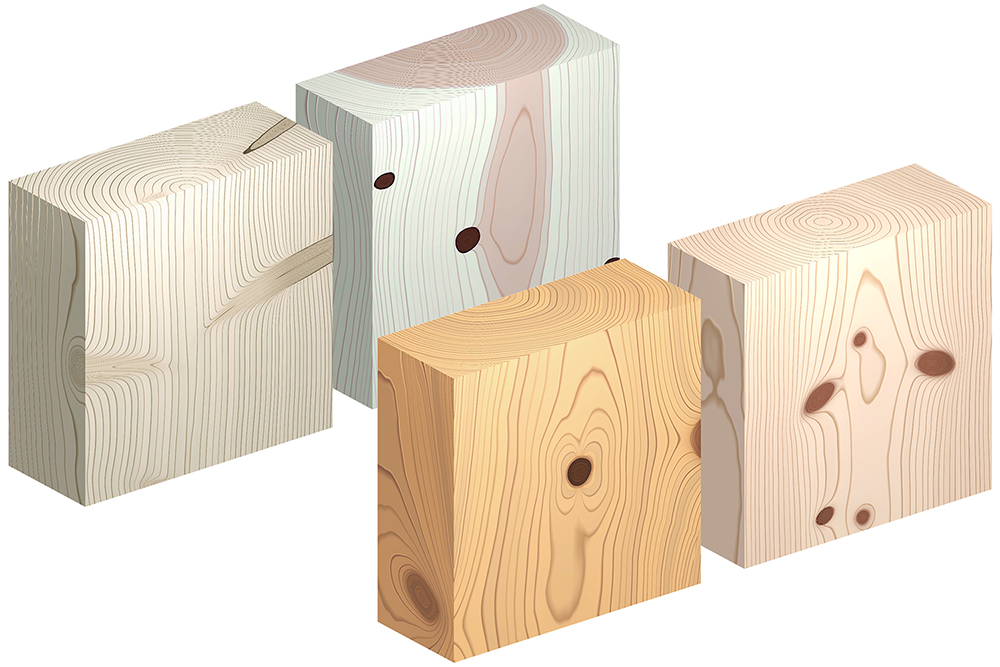

# Procedural Knots

This is the repository related to the publication "Procedural Texturing of Solid Wood with Knots," presented at SIGGRAPH 2022.
It is implemented as a shader program in PyOpenGL and GLSL.



### Environment
- Python 3.8.7
- pip 20.2.3
- Packages: [requirements.txt](requirements.txt)

It is recommended to use a virtual environment, for example [venv](https://docs.python.org/3/library/venv.html).

The following command will install the packages at once.
```
$ pip install -r requirements.txt
```

### Run Program
After installing the necessary packages, run the program with
```
$ python setup/main.py
```

### Feedback
If you experience any problems or have some suggestions for improvements, please share under [Issues](https://github.com/marialarsson/procedural_knots/issues).

## Links

Project page: http://www.ma-la.com/procedural_knots.html

Paper PDF: http://ma-la.com/procedural_knots/Procedural_Knots_2022.pdf

ACM link: https://dl.acm.org/doi/abs/10.1145/3528223.3530081
